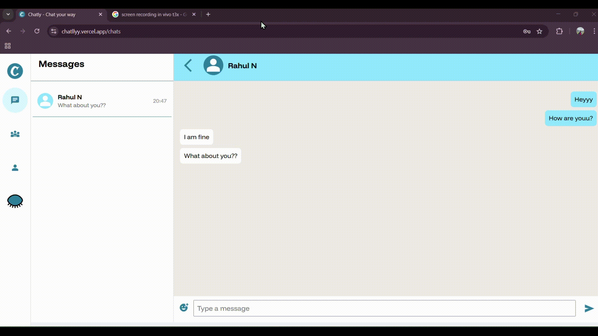
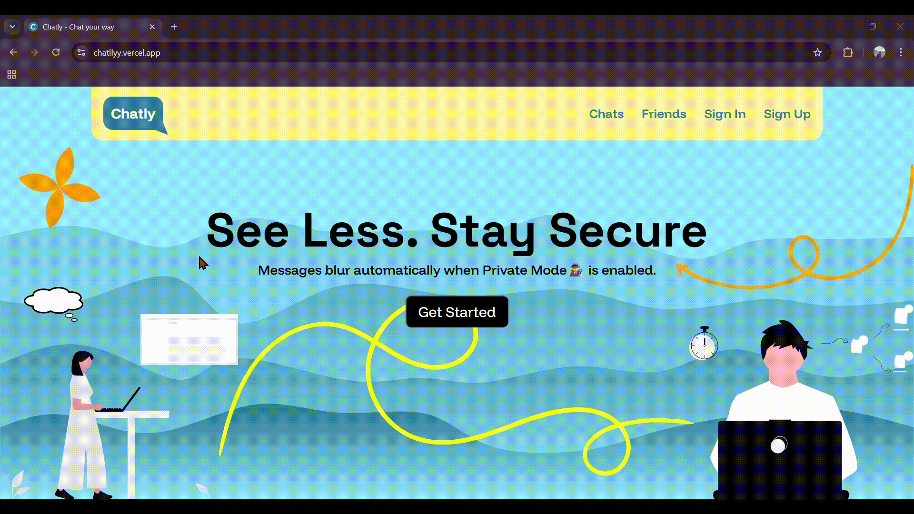
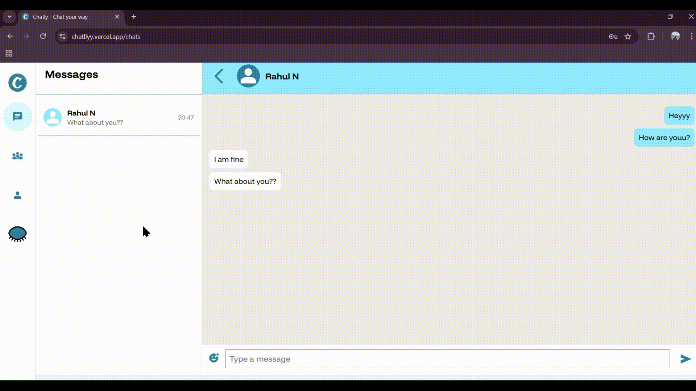
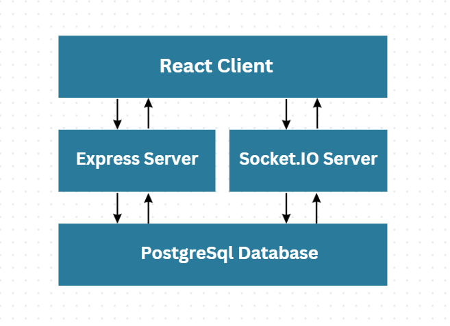

# Chatlly – Real-Time Chat Application




--- 

Chatlly is a **full-stack real-time messaging application** built with modern web technologies.
It enables users to communicate instantly with **live message updates, persistent chat history, and secure authentication**.

The application demonstrates **real-time communication architecture using WebSockets, efficient database querying with pagination, and secure cookie-based authentication**.


### Privacy Mode (Public / Private Chat)

Chatlly includes a **privacy-focused viewing mode** that allows users to control message visibility when using the application in public environments.

#### Implementation Overview

The feature is implemented on the client side using conditional UI rendering.

* A **mode state** controls whether messages should appear blurred
* Messages dynamically apply a **CSS blur filter**
* Users can toggle between modes instantly


---
<br>

# Live Application

Frontend
https://chatllyy.vercel.app

Backend API
https://chatly-real-time-chat-app.onrender.com

---
<br>
<br>

## Demo Videos

### Login Flow



Shows secure user authentication and session initialization.

---

---

### Application Working


Shows the full workflow including message sending and receiving.

---

### Logout Flow



Demonstrates proper session termination and cookie removal.

---

# Features

## Authentication

* Secure login and logout
* JWT-based authentication
* HTTP-only cookie storage
* Cross-origin cookie configuration

## Real-Time Messaging

* Instant message delivery using **Socket.IO**
* Real-time updates across connected clients
* Persistent socket connections

## Message Persistence

* Messages stored in **PostgreSQL**
* Indexed queries for improved performance
* Efficient message retrieval

## Message Pagination

* Chat history loads in **small batches**
* Prevents loading the entire conversation at once
* Improves performance for long conversations
* Supports loading older messages dynamically

## User Experience

* Clean chat interface
* Responsive layout
* Efficient state updates

---

# Tech Stack

## Frontend

React
Vite
Tailwind CSS
Socket.IO Client

## Backend

Node.js
Express.js
Socket.IO
JWT Authentication
Cookie Parser
CORS

## Database

PostgreSQL (Neon)

## Deployment

Frontend – Vercel
Backend – Render
Database – Neon PostgreSQL

---

# System Architecture

The application follows a client–server architecture with real-time communication.




### Components

**React Client**

* Handles UI rendering
* Sends authentication and message requests
* Maintains WebSocket connection

**Express API**

* Handles authentication
* Provides REST endpoints
* Manages database interactions

**Socket.IO Server**

* Handles real-time communication
* Emits message events to connected users
* Maintains active user connections

**PostgreSQL**

* Stores user data
* Stores message history
* Enables efficient retrieval using indexed queries

---

# Key Technical Challenges & Solutions

## 1. Real-Time Messaging

**Challenge**

HTTP-based communication cannot provide instant updates between users.

**Solution**

Implemented **Socket.IO WebSockets** to enable bidirectional communication.

When a user sends a message:

1. Message is saved in PostgreSQL
2. Socket.IO emits the event
3. Recipient receives the message instantly

---

## 2. Cross-Origin Authentication

**Challenge**

Frontend and backend are hosted on different domains (Vercel and Render), which blocks cookies by default.

**Solution**

Configured secure cross-origin cookies:

* `sameSite: "none"`
* `secure: true`
* `httpOnly: true`

Also configured CORS with credentials support.

---

## 3. Efficient Message Loading

**Challenge**

Loading the entire chat history becomes slow as conversations grow.

**Solution**

Implemented **pagination for messages**.

Messages are fetched in batches instead of loading all at once.

Benefits:

* Faster initial page load
* Reduced database load
* Better user experience

---

## 4. Socket Connection Management

**Challenge**

Managing multiple connected users and ensuring messages reach the correct recipient.

**Solution**

Maintained a **mapping between user IDs and socket IDs** on the server.

This allows messages to be emitted directly to the intended recipient.

---


# Project Structure

```
chatlly
│
├── frontend
│   ├── public
│   ├── src
│   │   ├── components
│   │   ├── pages
│   │   ├── contexts
│   │   ├── styles
│   │   ├── hooks
│   │   ├── utils
│   └── vite.config.js
│
├── backend
│   ├── src
│   │   ├── routes
│   │   ├── controllers
│   │   ├── middlewares
│   │   ├── models
│   │   ├── utils
│   │   ├── sockets
│   │   └── config
│   └── app.js
│
└── assets
    ├── Login.mp4
    ├── Logout.mp4
    ├── PrivateMode.mp4
    └── Working.mp4
    └── Architecture.png
```

# Why This Project Matters

This project demonstrates practical experience with:

* Real-time system design
* WebSocket-based communication
* Secure authentication flows
* Database query optimization
* Full-stack deployment

The architecture reflects patterns commonly used in modern messaging systems.

---

# Local Setup

Clone the repository

```
git clone https://github.com/Devender-Singh-Bisht/CHATly-Real-Time-Chat-App.git
cd chatlly
```

---

## Backend Setup

```
cd backend
npm install
```

Create `.env`

```
PORT=3000
SALT_ROUNDS=10
JWT_SECRET_KEY="your_secret_key"
CLIENT_URL="http://localhost:5173"
PGSQL_CONNECTION_STRING='your_connection_string'
```

Run server

```
npm run dev
```

---

## Frontend Setup

```
cd frontend
npm install
```

Create `.env`

```
VITE_API_URL="http://localhost:3000"
REACT_APP_SOCKET_URL="http://localhost:3000"
```

Run client

```
npm run dev
```

---
<br>

---

# Performance Considerations

Message pagination ensures that chat history loads efficiently even for long conversations.

Indexed database queries improve retrieval performance for chat messages.

WebSocket communication enables real-time updates without frequent API polling.

---

# Future Improvements

Typing indicators
Message read receipts
Group chat functionality
File and image sharing
Push notifications
Search within conversations

---

# Author

Devender Singh Bisht

GitHub
https://github.com/Devender-Singh-Bisht/

